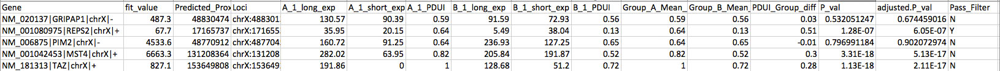

## 6.1 RNAeditor
1. 理解chr1.editingSites.vcf和chr1.editingSites.gvf的含义

* chr1.editingSites.vcf :对所有的编辑位点的一个粗略的展示。
> * chrom 代表位于那条染色体上
> * POS 代表variant位于染色体的哪一个位点，如果是INDEL则代表其第一个碱基所在的位置。
> * REF 代表在参考基因组上在POS上的碱基是什么
> * ALT 代表alter的碱基
> * QUAL 是以phred格式的质量值，其值越高代表该位点存在variant的概率越大。
> * FILTER 代表过滤结果是否可靠，PASS代表PASS，若不可靠，则该项不为"PASS"或“.”
> * INFO 为variant 的详细信息

* chr1.editingSites.gvf ：Gene Variation File 对==每个==编辑位点的更信息的信息注释，包括geneID、name、segment等


	
   **例如第一行，代表着，这个Variation 位于染色体1上的GeneID=ENSG00000225159，Name=NPM1P39，SEGMEMT=noncoding-exon,这段基因位于染色体的27206930-27207796，该Variation位于27206932，参考基因组上其为A，而Alter为G，其质量分数为66.28，共有7条reads，其中有6条发生了edited**
	
2. 根据chr1.editingSites.gvf文件，统计RNA编辑位点在基因组上的分布

```R
chr1.editingSites<-read_tsv("chr1.editingSites.gvf")
# 读取文件
chr1.editingSites%>%rename(Gene_ID=`#Gene_ID`)
# 对列名重命名
editingSites_summary<-chr1.editingSites%>%select(Gene_ID,Name,SEGMENT,Edited_Reads)
# 选取需要的4列
editingSites_summary<-editingSites_summary%>%group_by(Gene_ID,Name,SEGMENT)%>%summarise(number=sum(Edited_Reads))%>%ungroup()
# 将位于同一基因不同位点上的variant进行合并
editingSites_summary<-editingSites_summary%>%spread(SEGMENT,number)
# 将长数据转化为宽数据
editingSites_summary[is.na(editingSites_summary)]<-0
# 将NA值转化为0
```


```R
plot_editingSites<-chr1.editingSites%>%select(SEGMENT,Edited_Reads)%>%group_by(SEGMENT)%>%summarise(number=sum(Edited_Reads))%>%ungroup()

plot_editingSites%>%ggplot(aes(x=SEGMENT,y=number))+geom_bar(stat="identity",aes(fill=SEGMENT))+
theme_bw()+
ggtitle("Summary of editorSites region")+
theme(axis.text.x=element_text(colour="black",family="Times",size=14),axis.text.y=element_text(family="Times",size=14,face="plain"), axis.title.y=element_text(family="Times",size = 14,face="plain"), axis.title.x=element_text(family="Times",size = 14,face="plain"),plot.title = element_text(family="Times",size=25,face="bold",hjust = 0.5))+
theme(legend.title = element_text(size = 20),legend.text = element_text(size = 15),axis.title.x = element_text(size=20),axis.title.y = element_text(size=20),axis.text.x = element_text(size = 14,color="black"),axis.text.y = element_text(size = 14,color="black"))
```


## 6.2 APA(Alternative Polyadenylation)Detection

1. 产生Generate region annotation 
2. Identify APA events

### 6.2.a）对Alternative Polyadenylation (APA) background 的补充学习和理解
[Alternative Polyadenylation: Methods, Findings, and Impacts](https://www.sciencedirect.com/science/article/pii/S1672022917301341?via%3Dihub)
* 聚腺苷酸化发生在mRNA成熟的过程，对mRNA翻译效率、稳定性和定位有着重要的作用
*  真核生物基因拥有不止一个的PolyA位点，被称作alternative PolyA(APA),导致相同的基因产生不同的mRNA亚型
*  通过pA位点的定位，APA能够被分为两大类
	> 1. CR-APA(coding region-APA)：pA sites 位于exons或者introns内部，影响翻译区并且导致拥有不同C 末端的蛋白质亚型。
	>
	> 2. UTR-APA：APA位于3‘ untranslated region，最终产生具有相同的coding region但是具有不同的3’ UTR。更长的3‘UTR能够有更多的microRNA的结合位点，更多RBP识别位点，从而影响RNA二级结构

### 6.2.b） DaPars 工作原理

* DaPars  利用两个样本的摆动比对文件通过提取的远端Pa位点来推断近端的Pa位点

### 6.2.c)homework




> * Gene: 代表基因名称及其信息
> * predicted Proximal polyadenylation: 预测的近端的PolyA所在的位置
> * loci: 基因组信息
> * exp：A,B两个样本、长短两组的表达量
> * Group_A_Mean、Group_B_Mean: PDUI作为Mean值
> * PDUI_Group_diff:  等于Group_A_Mean-Group_B_Mean

1. 解释PDUI的含义

**代表一个远端的PolyA位点使用占比，数值在0-1，可以利用这个数值来评价APA事件发生的比例，如果PDUI接近于1代表这个基因更多的存在长的3’UTR，如果PDUI接近于0代表这个基因更多存在短的3‘UTR**

2. 写脚本过滤adjusted.P_val<=0.05,PDUI_Group_diff>=0.5, PDUI_fold_change>=0.59的作为diff-APA events，和Pass_filter为“Y“筛选出来的diff-APA events做比较。

```linux
# 按照adjusted.P_val<=0.05,PDUI_Group_diff>=0.5,PDUI_fold_change>=0.59 过滤数据
awk -F'\t' 'NR!=1{if($13>=0.5 && $15<=0.05 && $11/$12>0.59) print $0}' DaPars_Test_data_All_Prediction_Results.txt
```


```linux
# 按照Pass_filter=="Y"筛选的diff-APA events
awk -F'\t' 'NR!=1{if($16=="Y") print $0}' DaPars_Test_data_All_Prediction_Results.txt
```


两者筛选出来APA_diff一致

3.  思考
> * **我自己理解的是A,B两个样本之间通过PDUI的差值，来说明这个基因上的不同PolyA位点之间的距离差距。通过FDR、PDUI、Fold_change来判断这样距离的差距是否是明显的。假如A,B两个样本的PDUI值非常相近，则可能是同一个PolyA位点，而非diff-APA。**
> * **因此我觉得，假如软件中对A,B没有control和test之间的区别的话，应该以PDUI_Group_diff的绝对值>=某个值作为筛选的标准，因为无论是A>B,B>A应该是以A,B之间的距离来判断两个PolyA之间的距离**


## 6.3 Ribo-seq
### 6.3.a) Backgroud
   Ribo-seq是==细胞内蛋白翻译图谱的新型二代测序技术，用来描述全基因组水平蛋白质的翻译情况。主要是==选择性捕捉80S核糖体及其结合的RNA片段而定位核糖体所位于的RNA位置。
>  * 在细胞裂解物中富集多聚核糖体(polysome)
>  * 将多聚体核糖体用核酸酶(RNA nuclease)消化为单核糖体(monosome)
>  * 选择性的收集和富集80S核糖体并经纯化得到80S核糖体所保护的RNA片段。
>  * 在此过程中，将80S核糖体保护的RNA片段进行下一步构建文库和测序

### 6.3.b) homework
1. 解释TE的含义，用教程中的示例文件算出TE，并画出TE的分布。
* **TE = 翻译水平的abundance/转录水平的abundance，反映翻译效率。**
* **翻译水平的abuandance=ORF上的reads数/ORF长度**
* **转录水平上的abundant=FPKM value from paired RNA-seq**
* 其中以具有翻译活性的P-sites在ORF上的富集程度来反映翻译水平 
* TE = FPKM(translational_level) / FPKM(transcriptional_level)

2. TE的分布情况并作图

**2.1 TE的整体分布情况**


**2.2 在TE富集的区域的TE详细分布情况**


## 6.4 Structure-seq
### 6.4.a) 实验原理
   **RNA能够进行折叠，在部分区域能自身配对形成双链的RNA，通过SHAPE reagent能在构象上动态变化的核苷酸上反应(没有形成双链的部位)；在随后的反转录过程中，聚合酶将SHAPE adduct的读段，将与原始读段非互补的核苷酸参入cDNA；再对产生的cDNA进行大规模并行的测序，来创造一个突变特征谱；通过计算核苷酸-分辨率突变率，并进行校正背景以及正则化，产生一个标准的SHAPE反应曲线谱，通过SHAPE反应谱来对RNA二级结构进行建模，对竞争性结构和替代结构，量化调节局部核苷酸动态变化的任何过程或者功能**

ShapeMapper能够通过突变分析实验(MaP)自动的计算出RNA结构探测反应性

### 6.4b) homework
   **SHAPE reactivity 反应的是核苷酸与SHAPE试剂的反应性。表示的是在单核苷酸分辨率下，一个核苷酸位点经SHAPE 试剂处理后，该位点核苷酸被修饰的概率，具体体现为在反转录后所得到的cDNA中，该位点发生突变的频率，取值为0-1。通常按照Nucleotide position作图。SHAPE reactivity 与核苷酸构象的稳定性有关，能够反映RNA 的结构与能量。拥有更灵活构象的无约束的核苷酸具有更大的可能性拥有SHAPE反映性构象，因此显示出更高的SHAPE反应性**

### 6.4 c) supplement
**在实验过程中，发现docker中没有shapemapper软件，需要自行下载，下载方式如下**
参考链接: [ShapeMapper2](https://github.com/Weeks-UNC/shapemapper2)

```linux
# 下载相应的文件并解压
wget https://github.com/Weeks-UNC/ShapeMapper2/releases/download/2.1.5/shapemapper-2.1.5.tar.gz
tar -xvf shapemapper-2.1.5.tar.gz

# 将 shapemapper添加到PATH路径中
export PATH=/home/zhaoyizi/shapemapper-2.1.5:$PATH
#永久保存，编辑 .bashrc ,在文档最后运行 
export PATH=“/home/zhaoyizi/shapemapper-2.1.5:$PATH”

```


## 6.5) Chimeric RNA	Detection

**chimeric RNA are produced by two or more gene loci**

   使用STAR将Fastq比对到参考基因组上，输出Chimeric.out.junction文件。

   进行一下更正：原先在教程上提示挂载的ctat_genome_lib_build_X_docker.zip,ref_genome.fa.star.idx.zip可能存在一定问题，可以直接下载在清华云中的[ctat_genome_lib_build_X_docker.part1.rar](https://cloud.tsinghua.edu.cn/d/747db0edd36449289b6f/?p=%2FFiles%2FPART_III%2F6.RNA%20Regulation%20Analyses%2FChimeric%20RNA&mode=list)。然后解压到桌面。按照教程进行挂载即可。==若是MAC系统，遇到使用解压失败的问题，可以试试使用KeKa软件==
### 6.5.a）results


* 输出文件 展示了 融合基因名称、组成这个融合基因的两个基因名称以及处在染色体的具体位置、表达量等等信息。


## 6.6) SNV/INDEL Detection

**通过RNA-seq寻找DNA上的SNV和INDEL**

### 6.6.a）software
通过Bowtie、TopHat、HISAT、STAR能将RNA测序数据比对到参考基因组中。

**GATK用于检测变异(SNA/INDEL)的软件。**

### 6.6.b) workflow
1. Alignment：使用STAR将RNA测序数据fastq文件比对到参考基因组上
2. MarkDuplicates：使用GATK对重复序列进行标记，使后续变异检测软件可以识别这些重复序列。如果变异位点位于重复序列之中，可能会导致变异频率偏高
3. SplitCigarReads：RNA出的reads可能会跨越不同的exon，在CIGAR表达式中会出现N值，使用GATK中的SplitCigarReads模块，将reads切分为k+1个reads。(k为CIGAR中的N的数量)。
4. HaplotypeCaller：使用GATK进行变异检测。得到VCF variant call format(存储变异位点的标准格式)描述SNP，INDEL，SV结果的文本文件。
5. VariantFilter：更具变异的聚集度(--windows\--cluster 3)、变异的链偏好性(--filter-name 'FS'\--filter 'FS > 30.0')、变异的平均质量水平(--filter-name 'QD')、位点测序深度(--filter-name'DP')等指标进行过滤
6. Annotation：对得到的变异进行注释：变异位置；在人群中的频率、临床意义等等。可以使用ANNOVAR注释的公共数据库。程序现将文件从VCF格式转换为avinput格式，再对。avinput格式保存的变异进行注释。将注释之后的以.txt\.vcf两种形式保存。

### 6.6.c) output


1. 每一行即一个变异位点的基本信息及在注释的公共数据库中的注释信息
2. 前五列为SNV变异位点的基本信息包括chr、start、end、ref、alt。
3. 后续若干列为在annotation中选用的注释公共数据库中的注释信息。如在ensGene注释数据库中，该变异位点的名称、功能、所位于的基因名称等等。
4. otherinfo中包含了该变异位点更详细的信息。


